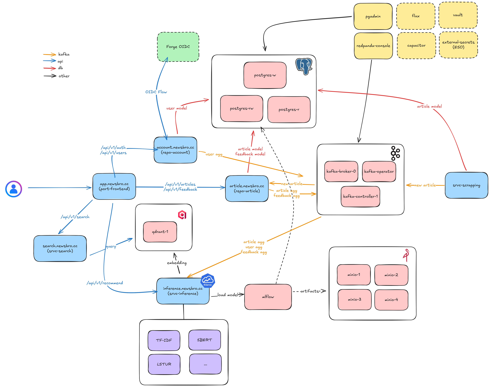

# NewsBro - MLOPS Final Project

Distributed resilient architecture for news recommendation

## Table of Contents
- [Project Structure](#project-structure)
- [Documentation](#documentation)
- [Architecture](#architecture)
- [Testing](#testing)
- [Deployment](#deployment)
- [Deployment Specifications](#deployment-specifications)

## Project Structure

```
.
├── apps
│   ├── repo-account
│   ├── repo-article
│   ├── port-front
│   ├── srvc-scrapping
│   ├── srvc-search
│   └── srvc-inference
├── docs
├── dev                          # dev folder for various dev operations
├── k8s
│   ├── apps                     # deployment of each apps
│   ├── capacitor                # Frontend to manage flux
│   ├── cert-manager             # Manager TLS certificate
│   ├── external-secrets         # ESO to communicate with vault
│   ├── flux/flux-system         # deployment of flux repo (gitops tools)
│   ├── kafka                    # Kafka brokers, controllers, redpanda console and topic definition
│   ├── minio                    # Minio cluster storage (datalake + store for mlflow artifacts)
│   ├── mlflow
│   ├── postgres                 # CNPG CRD, database definition, user definition
│   ├── qdrant                   # Vector database
│   └── vault                    # Vault server to store secrets, act as authenticator for SA in kubernetes
├── .github/workflows/
└── README.md
```

## Architecture

The project is built with a microservices architecture including the following components :

- `repo-account`: User account and login management
- `repo-article`: Article & feedbacks management
- `srvc-scrapping`: Scrapping for articles, ingest to kafka
- `srvc-search`: Search service
- `srvc-inference`: Inference service to provide use recommendation
- `port-front`: main frontend



## Testing

Individual service tests can be run by navigating to the specific service directory and executing:

```bash
docker compose up -d
cd apps/<service-name> # TODO
cd ../..
docker compose down
```

## Deployment

Our Project is deployed on Kubernetes. The deployment process is handled through our CI/CD pipeline.

To deploy the whole stack, just use:

```bash
kubectl apply -k k8s/ # TODO
```

## Deployment Specifications

TODO

