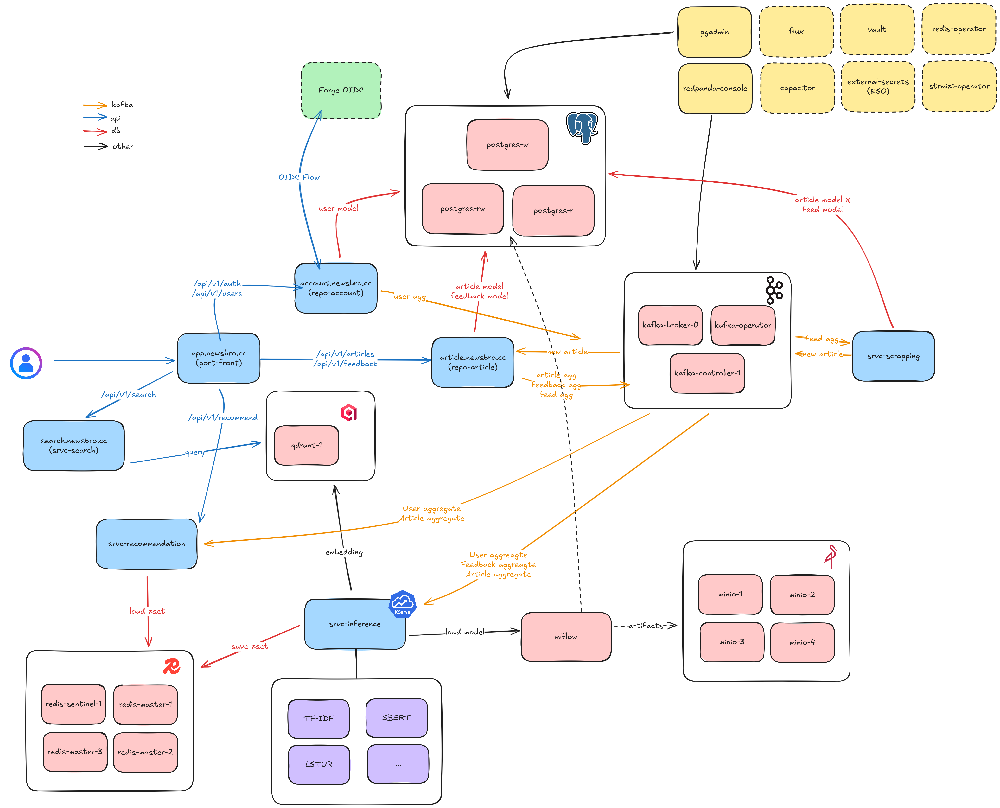
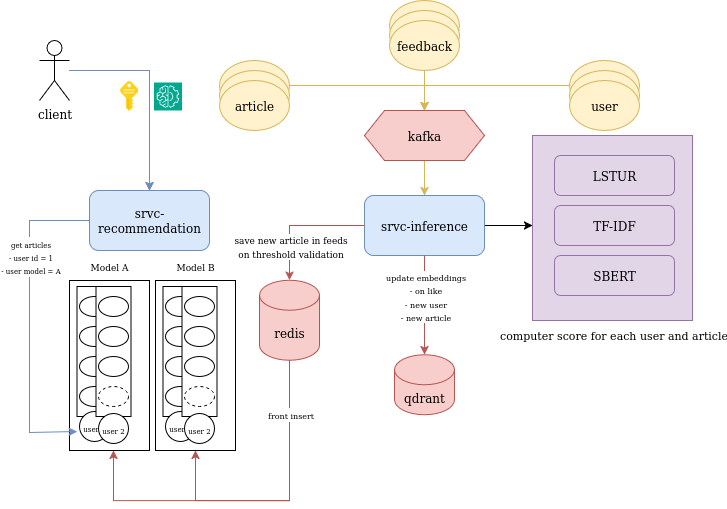

# NewsBro - MLOPS Final Project

Distributed resilient architecture for news recommendation

Feel free to have a look at our [website](https://app.newsbro.cc) to create your account
and interact with 100k+ articles.


We provide automatic update everyday (9am / 6pm UTC), 10k articles ingested
from various sources. We also provide new recommendation based on your liked articles.

Feel free to open issues if you see anything relevant that could be added.

⚠ App will be down at the end of our project (~ Jan. 2026)

## Table of Contents
- [Project Structure](#project-structure)
- [Architecture](#architecture)
    - [User Feed](#handling-user-feeds)
- [Development](#dev)
    - [Backends](#working-with-backends)
    - [Frontend](#working-with-frontend)
    - [CI/CD](#cicd)
    - [Commits](#commits)
- [Deployment](#deployment)
    - [Deployment Specifications](#deployment-specifications)

### Privacy Note

We only use your feedback to improve our system recommenders.
- Passwords are never stored, authentication is handled through secure and short-lived JWT.
- Internal credentials are randomly generated for each session and securely stored in Vault, never embedded in code, only injected as env variables.
- All feedback data is anonymized before being used for training or evaluation (only `user_id` is used), ensuring that no personally identifiable information is retained.
- Data transmission is encrypted (TLS) between client & dns provider, and between dns provider and server.

All internal data will be securely erased once the project concludes.

## Project Structure

```
.
├── apps
│   ├── repo-account
│   ├── repo-article
│   ├── port-front
│   ├── srvc-scrapping
│   ├── srvc-search
│   └── srvc-inference
├── docs
├── dev                          # dev folder for various dev operations
├── k8s
│   ├── apps                     # deployment of each apps
│   ├── capacitor                # Frontend to manage flux
│   ├── cert-manager             # Manager TLS certificate
│   ├── external-secrets         # ESO to communicate with vault
│   ├── flux/flux-system         # deployment of flux repo (gitops tools)
│   ├── kafka                    # Kafka brokers, controllers, redpanda console and topic definition
│   ├── minio                    # Minio cluster storage (datalake + store for mlflow artifacts)
│   ├── mlflow
│   ├── postgres                 # CNPG CRD, database definition, user definition
│   ├── qdrant                   # Vector database
│   ├── redis                    # Redis Operator, Insight and Sentinels
│   └── vault                    # Vault server to store secrets, act as authenticator for SA in kubernetes
├── .github/workflows/
└── README.md
```

## Architecture

The project is built with a microservices architecture including the following components :

- `repo-account`: User account and login management
- `repo-article`: Article & feedbacks management
- `srvc-scrapping`: Scrapping for articles, ingest to kafka
- `srvc-search`: Search service
- `srvc-inference`: Inference service to provide update user feeds
- `srvc-recommendation`: Service providing the user feed
- `port-front`: main frontend



### Handling user feeds



## Dev

We provide a generic docker compose to run a minimal stack at `apps/docker-compose.yml`

### Working with backends

- For go app:

```bash
cd apps/$SRVC
docker compose up -d
go run src/cmd/main.go
docker compose down
```

- For python app:

```bash
cd apps/$SRVC
docker compose up -d
# TODO
docker compose down
```

### Working with frontend

- We use a vite proxy to handle requests to our backends
- Backends should be up
- `apps/docker-compose.yml` should be up

```bash
cd apps/port-front
npm ci
npm run dev
```

### CI/CD

- Our CI/CD will lint, build and test backend codes.
- To deploy a new version just tag `<srvc-name>-vx.x.x`.

### Commits

Example of commit we use:

```
k8s: redis: increase redis sentinel for minimal config
apps: port-front: now using get profile to retrieve user info as cookies could not be read by frontend
apps: review swagger, specify dto for errors
```

## Deployment

Our Project is deployed with Kubernetes. We [FluxCD](https://fluxcd.io/) as GitOps tool to automate the deployment of our new manifests.

To deploy the whole stack, just use:

```bash
kubectl apply -k k8s/flux/flux-system
```

### Deployment Specifications

TODO

